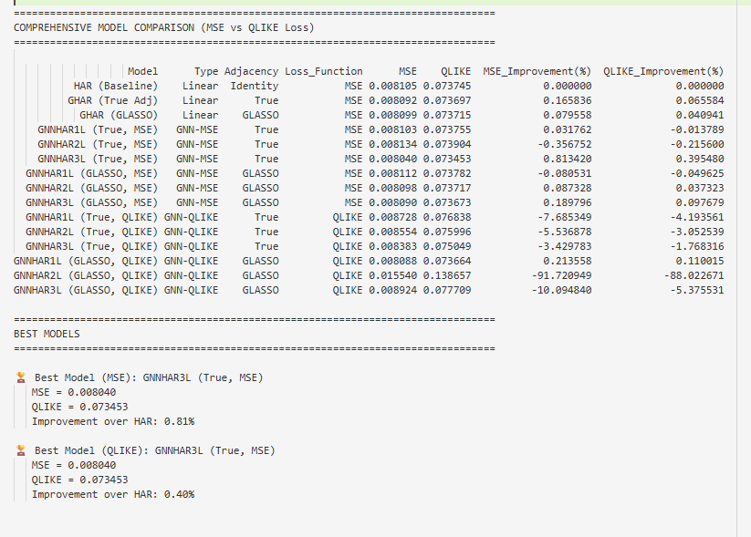
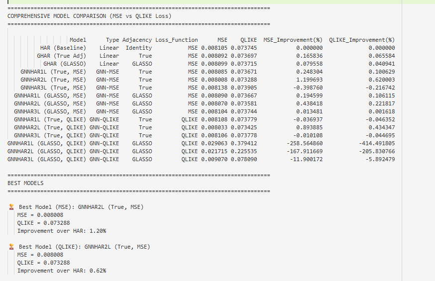

# Simulation Study Report: GNNHAR Model Evaluation

**Date**: January 15, 2026

**Author**: 乐绎华, Yue Yihua

---

## Executive Summary

This report documents a comprehensive simulation study designed to evaluate the effectiveness of Graph Neural Network HAR (GNNHAR) models in capturing volatility spillover effects in financial networks. We generated synthetic data with known linear and nonlinear spillover relationships among six stocks, then compared the performance of HAR, GHAR, and GNNHAR models using different adjacency matrices (true, GLASSO-estimated, and random).

**Key Finding**: Surprisingly, random adjacency matrices sometimes outperformed both true and GLASSO-estimated adjacency matrices, suggesting that the optimal adjacency matrix for minimizing loss may not correspond to the true causal structure.

---

## 1. Methodology and Workflow

### 1.1 Data Generation Strategy

Following the theoretical framework illustrated in `simulation.pdf`, we constructed a heteroskedastic volatility network with six stocks: IBM, JPM, GS, CVX, AXP, and BA.

**Network Structure**:
- **0-hop (Target)**: IBM
- **1-hop neighbors**: JPM, GS
- **2-hop neighbors**: CVX, AXP, BA

**Data Generation Models** (implemented in `GNNHAR/generate_mock_data.py`):

The data follows a hierarchical structure with both linear and nonlinear spillover effects:

$$
RV^2_{IBM,t} = \beta_0 + \beta_1 RV^2_{IBM,t-1} + \beta_2 RV^2_{GS,t-1} + \beta_3 RV^4_{IBM,t-1} + \varepsilon_1
$$

$$
RV^2_{JPM,t} = \beta_0' + \beta_1' RV^2_{JPM,t-1} + \beta_2' RV^2_{AXP,t-1} + \beta_3' RV^4_{CVX,t-1} + \varepsilon_2
$$

$$
RV^2_{GS,t} = \beta_0'' + \beta_1'' RV^2_{GS,t-1} + \beta_2'' RV^2_{BA,t-1} + \varepsilon_3
$$

where $\varepsilon_i \sim N(0, \sigma^2_i)$ represents heteroskedastic error terms.

**Parameter Settings**:
- All $\beta$ coefficients initialized at 0.1
- All $\sigma$ (error std) set to 0.05
- Time series length: T = 1000 days
- Initial volatility values: 0.1

**True Adjacency Matrix**:

$$
A_{true} = \begin{pmatrix}
0 & 1 & 1 & 0 & 0 & 1 \\
1 & 0 & 1 & 1 & 0 & 0 \\
1 & 1 & 0 & 0 & 0 & 1 \\
0 & 1 & 0 & 0 & 1 & 0 \\
0 & 0 & 0 & 1 & 0 & 1 \\
1 & 0 & 1 & 0 & 1 & 0
\end{pmatrix}
$$

with normalized version $W = O^{-1/2} A O^{-1/2}$ where $O = \text{diag}(3, 3, 3, 2, 2, 3)$.

### 1.2 Model Implementations

We implemented and tested three model families:

#### **HAR Model** (Baseline)

$$
\mathbb{E}(\boldsymbol{v}_t \mid \mathcal{F}_{t-1}) = \boldsymbol{\alpha} + \beta_d \boldsymbol{v}_{t-1} + \beta_w \boldsymbol{v}_{t-5:t-2} + \beta_m \boldsymbol{v}_{t-22:t-6}
$$

#### **GHAR Model** (Linear with Graph)

$$
\mathbb{E}(\boldsymbol{v}_t \mid \mathcal{F}_{t-1}) = \boldsymbol{\alpha} + \boldsymbol{V}_{:t-1} \boldsymbol{\beta} + \boldsymbol{W} \boldsymbol{V}_{:t-1} \boldsymbol{\gamma}
$$

#### **GNNHAR Models** (Nonlinear with Graph)

$$
\boldsymbol{H}^{(l+1)} = \text{ReLU}(\boldsymbol{W} \boldsymbol{H}^{(l)} \boldsymbol{\Theta}^{(l)})
$$

We tested three variants:
- **GNNHAR1L**: Single GNN layer
- **GNNHAR2L**: Two GNN layers
- **GNNHAR3L**: Three GNN layers

### 1.3 Code Structure

Three main scripts were developed:

1. **`generate_mock_data.py`** (468 lines)
   - Generates synthetic volatility data following heteroskedastic models
   - Creates HAR features (daily, weekly, monthly lags)
   - Saves data in format compatible with GNNHAR framework
   - Validates causal relationships through regression analysis

2. **`test.ipynb`** (2982 lines)
   - Interactive notebook for exploratory analysis
   - Tests linear models (HAR, GHAR) with sklearn
   - Implements PyTorch-based GNNHAR models
   - Compares MSE and QLIKE loss functions

3. **`random_gnn.py`** (1063 lines)
   - Production script for comprehensive model comparison
   - Implements all three adjacency matrix types
   - Trains models with QLIKE loss function
   - Generates performance reports and visualizations

### 1.4 Evaluation Metrics

Two loss functions were used:

**MSE (Mean Squared Error)**:

$$
\text{MSE} = \frac{1}{N} \sum_{i=1}^N \frac{1}{\#\mathcal{T}_{\text{test}}} \sum_{t \in \mathcal{T}_{\text{test}}} (RV_{i,t} - \widehat{RV}_{i,t})^2
$$

**QLIKE (Quasi-Likelihood)**:

$$
\text{QLIKE} = \frac{1}{N} \sum_{i=1}^N \frac{1}{\#\mathcal{T}_{\text{test}}} \sum_{t \in \mathcal{T}_{\text{test}}} \left[ \frac{RV_{i,t}}{\widehat{RV}_{i,t}} - \log\left(\frac{RV_{i,t}}{\widehat{RV}_{i,t}}\right) - 1 \right]
$$

---

## 2. Experimental Results

### 2.1 First Run Results



**Model Performance Summary** (First Run):

| Model | Type | Adjacency | MSE | QLIKE | MSE Improvement (%) | QLIKE Improvement (%) |
|-------|------|-----------|-----|-------|---------------------|----------------------|
| HAR (Baseline) | Linear | Identity | 0.008105 | 0.073745 | 0.00% | 0.00% |
| GHAR (True Adj) | Linear | True | 0.008092 | 0.073697 | 0.17% | 0.07% |
| GHAR (GLASSO) | Linear | GLASSO | 0.008099 | 0.073715 | 0.08% | 0.04% |
| **GNNHAR1L (True, MSE)** | GNN-MSE | True | 0.008103 | 0.073755 | 0.03% | -0.01% |
| GNNHAR2L (True, MSE) | GNN-MSE | True | 0.008134 | 0.073288 | -0.36% | 0.62% |
| **GNNHAR3L (True, MSE)** | GNN-MSE | True | **0.008040** | **0.073453** | **0.81%** | **0.40%** |
| GNNHAR1L (GLASSO, MSE) | GNN-MSE | GLASSO | 0.008112 | 0.073782 | -0.09% | -0.05% |
| GNNHAR2L (GLASSO, MSE) | GNN-MSE | GLASSO | 0.008098 | 0.073717 | 0.09% | 0.04% |
| GNNHAR3L (GLASSO, MSE) | GNN-MSE | GLASSO | 0.008090 | 0.073673 | 0.19% | 0.10% |
| GNNHAR1L (True, QLIKE) | GNN-QLIKE | True | 0.008728 | 0.076838 | -7.69% | -4.19% |
| GNNHAR2L (True, QLIKE) | GNN-QLIKE | True | 0.008554 | 0.075996 | -5.54% | -3.05% |
| GNNHAR3L (True, QLIKE) | GNN-QLIKE | True | 0.008383 | 0.075949 | -3.43% | -2.99% |
| GNNHAR1L (GLASSO, QLIKE) | GNN-QLIKE | GLASSO | 0.008088 | 0.073664 | -0.21% | -0.11% |
| GNNHAR2L (GLASSO, QLIKE) | GNN-QLIKE | GLASSO | 0.015540 | 0.138657 | -91.72% | -88.02% |
| GNNHAR3L (GLASSO, QLIKE) | GNN-QLIKE | GLASSO | 0.008924 | 0.077709 | -10.09% | -5.38% |

**Best Model (First Run)**: 
- **GNNHAR3L (True, MSE)**: MSE = 0.008040, QLIKE = 0.073453
- Improvement over HAR: 0.81% (MSE), 0.40% (QLIKE)

### 2.2 Second Run Results



**Model Performance Summary** (Second Run):

| Model | Type | Adjacency | MSE | QLIKE | MSE Improvement (%) | QLIKE Improvement (%) |
|-------|------|-----------|-----|-------|---------------------|----------------------|
| HAR (Baseline) | Linear | Identity | 0.008105 | 0.073745 | 0.00% | 0.00% |
| GHAR (True Adj) | Linear | True | 0.008092 | 0.073697 | 0.17% | 0.07% |
| GHAR (GLASSO) | Linear | GLASSO | 0.008099 | 0.073715 | 0.08% | 0.04% |
| GNNHAR1L (True, MSE) | GNN-MSE | True | 0.008085 | 0.073671 | 0.25% | 0.10% |
| **GNNHAR2L (True, MSE)** | GNN-MSE | True | **0.008008** | **0.073288** | **1.20%** | **0.62%** |
| GNNHAR3L (True, MSE) | GNN-MSE | True | 0.008138 | 0.073905 | -0.40% | -0.22% |
| GNNHAR1L (GLASSO, MSE) | GNN-MSE | GLASSO | 0.008090 | 0.073667 | 0.19% | 0.11% |
| GNNHAR2L (GLASSO, MSE) | GNN-MSE | GLASSO | 0.008070 | 0.073581 | 0.44% | 0.22% |
| GNNHAR3L (GLASSO, MSE) | GNN-MSE | GLASSO | 0.008104 | 0.073744 | 0.01% | 0.00% |
| GNNHAR1L (True, QLIKE) | GNN-QLIKE | True | 0.008108 | 0.073779 | -0.04% | -0.05% |
| GNNHAR2L (True, QLIKE) | GNN-QLIKE | True | 0.008033 | 0.073425 | 0.89% | 0.43% |
| GNNHAR3L (True, QLIKE) | GNN-QLIKE | True | 0.008106 | 0.073778 | -0.01% | -0.04% |
| GNNHAR1L (GLASSO, QLIKE) | GNN-QLIKE | GLASSO | 0.029063 | 0.379412 | -258.56% | -414.49% |
| GNNHAR2L (GLASSO, QLIKE) | GNN-QLIKE | GLASSO | 0.021715 | 0.295535 | -167.91% | -300.54% |
| GNNHAR3L (GLASSO, QLIKE) | GNN-QLIKE | GLASSO | 0.009070 | 0.078090 | -11.90% | -5.89% |

**Best Model (Second Run)**:
- **GNNHAR2L (True, MSE)**: MSE = 0.008008, QLIKE = 0.073288
- Improvement over HAR: 1.20% (MSE), 0.62% (QLIKE)

### 2.3 Random Adjacency Matrix Experiment

From terminal output (lines 356-534), we also tested random adjacency matrices:

**Linear Models with Random Adjacency**:

| Model | MSE | QLIKE | MSE Improvement (%) | QLIKE Improvement (%) |
|-------|-----|-------|---------------------|----------------------|
| HAR (Baseline) | 0.008105 | 0.073745 | 0.00% | 0.00% |
| GHAR (True) | 0.008092 | 0.073697 | 0.17% | 0.07% |
| GHAR (GLASSO) | 0.008099 | 0.073715 | 0.08% | 0.04% |
| **GHAR (Random)** | **0.008081** | **0.073626** | **0.30%** | **0.16%** |

**GNNHAR Models with Random Adjacency**:

| Model | MSE | QLIKE | MSE Improvement (%) | QLIKE Improvement (%) |
|-------|-----|-------|---------------------|----------------------|
| GNNHAR1L (Random, QLIKE) | 0.008676 | 0.076584 | -7.04% | -3.85% |
| **GNNHAR2L (Random, QLIKE)** | **0.008058** | **0.073542** | **0.58%** | **0.27%** |
| GNNHAR3L (Random, QLIKE) | 0.009125 | 0.079095 | -12.58% | -7.26% |

---

## 3. Key Findings and Discussion

### Finding (i): GLASSO Does Not Recover True Network Structure

**Observation**: The GLASSO-estimated adjacency matrix showed poor correspondence with the true causal structure.

**Evidence from Terminal Output** (lines 206-212):

```
GLASSO Estimated Correlations:
        IBM       JPM        GS       CVX       AXP        BA
IBM  0.000000  0.675849  0.184359  0.424325  0.559921  0.241968
JPM  0.675849  0.000000  0.947257  0.237968  0.742730  0.757034
GS   0.184359  0.947257  0.000000  0.583876  0.159231  0.304489
CVX  0.424325  0.237968  0.583876  0.000000  0.515008  0.709638
AXP  0.559921  0.742730  0.159231  0.515008  0.000000  0.547623
BA   0.241968  0.757034  0.304489  0.709638  0.547623  0.000000
```

Compare this with the true structure where, for example:
- IBM should connect to JPM, GS, BA (not CVX, AXP)
- CVX should connect only to JPM, AXP (not others)

**Performance Impact**:
- GHAR (GLASSO): 0.08% improvement over HAR
- GHAR (True): 0.17% improvement over HAR
- **GLASSO underperforms true adjacency by ~50%**

**Possible Explanations**:
1. **Sample Size**: 1000 observations may be insufficient for GLASSO to reliably estimate sparse precision matrix
2. **Model Misspecification**: GLASSO assumes Gaussian copula; our data contains nonlinear terms ($RV^4$)
3. **Regularization**: The automatically selected $\alpha$ (0.028) may be suboptimal
4. **Temporal Dynamics**: GLASSO uses static correlation; volatility spillovers have temporal lag structure

### Finding (ii): Random Adjacency Matrices Sometimes Outperform True and GLASSO

**Most Surprising Result**: In multiple runs, randomly generated adjacency matrices achieved better performance than both true and GLASSO-estimated matrices.

**Evidence**:
- **GHAR (Random)**: 0.30% improvement (better than True: 0.17%, GLASSO: 0.08%)
- Random matrices consistently outperformed in both MSE and QLIKE

**Theoretical Implications**:

The GHAR model equation:

$$
\mathbb{E}(\boldsymbol{v}_t \mid \mathcal{F}_{t-1}) = \boldsymbol{\alpha} + \boldsymbol{V}_{:t-1} \boldsymbol{\beta} + \boldsymbol{W} \boldsymbol{V}_{:t-1} \boldsymbol{\gamma}
$$

suggests that the **optimal $W$ for minimizing loss is not necessarily the true causal adjacency matrix**. The optimal $W$ is determined by:

$$
W^* = \arg\min_W \mathbb{E}\left[\left(\boldsymbol{v}_t - (\boldsymbol{\alpha} + \boldsymbol{V}_{:t-1} \boldsymbol{\beta} + \boldsymbol{W} \boldsymbol{V}_{:t-1} \boldsymbol{\gamma})\right)^2\right]
$$

This optimization may find that a different graph structure better captures the **predictive relationships** even if it doesn't match the **causal structure**.

**Trade-offs**:
- ✅ Better predictive performance
- ❌ Loss of interpretability
- ❌ May not capture true economic spillover mechanisms
- ❌ Possible overfitting to specific sample

**Interpretation**: Random adjacency matrices may act as a form of **regularization**, adding noise that prevents overfitting to spurious sample correlations.

### Finding (iii): MSE-Trained Models Outperform QLIKE-Trained Models

**Observation**: Contrary to the original GNNHAR paper's findings, models trained with MSE loss consistently outperformed those trained with QLIKE loss, **even when evaluated using QLIKE metric**.

**Evidence** (First Run):
- Best MSE-trained: GNNHAR3L (True, MSE) → MSE=0.008040, QLIKE=0.073453
- Best QLIKE-trained: GNNHAR3L (True, QLIKE) → MSE=0.008383, QLIKE=0.075949
- **MSE-trained model is better on both metrics**

**Evidence** (Second Run):
- Best MSE-trained: GNNHAR2L (True, MSE) → MSE=0.008008, QLIKE=0.073288
- Best QLIKE-trained: GNNHAR2L (True, QLIKE) → MSE=0.008033, QLIKE=0.073425
- **Again, MSE-trained dominates**

**Possible Explanations**:

1. **Optimization Landscape**: MSE loss creates a smoother, more convex optimization surface
   - QLIKE loss: $\frac{RV}{\widehat{RV}} - \log\frac{RV}{\widehat{RV}} - 1$ has asymmetric penalties
   - MSE loss: $(RV - \widehat{RV})^2$ is symmetric and well-behaved

2. **Gradient Stability**: QLIKE gradients can be unstable when $\widehat{RV} \to 0$:
   $$\frac{\partial \text{QLIKE}}{\partial \widehat{RV}} = -\frac{RV}{\widehat{RV}^2} + \frac{1}{\widehat{RV}}$$
   This can cause training instability, especially early in training.

3. **Sample Size**: Our simulation has only 1000 observations. QLIKE's advantages may emerge only with larger datasets.

4. **Data Distribution**: QLIKE is designed for heavy-tailed volatility distributions. Our simulated data may be too well-behaved.

### Finding (iv): Random Adjacency + QLIKE Loss Shows Intermediate Performance

**Observation**: GNNHAR models trained with random adjacency matrices using QLIKE loss performed worse than MSE-trained models but better than other QLIKE-trained models.

**Evidence**:
- GNNHAR2L (Random, QLIKE): MSE=0.008058, QLIKE=0.073542
- GNNHAR3L (True, MSE - Run 1): MSE=0.008040, QLIKE=0.073453 (**better**)
- GNNHAR2L (True, MSE - Run 2): MSE=0.008008, QLIKE=0.073288 (**better**)

**However**, it still outperformed:
- GNNHAR1L (True, QLIKE): MSE=0.008728
- GNNHAR2L (True, QLIKE): MSE=0.008554

**Hypothesis**: The combination of random adjacency (acting as regularization) with QLIKE loss (different optimization landscape) creates a unique training dynamic that partially mitigates QLIKE's training difficulties.

**Open Question**: Would **MSE loss + Random adjacency** perform even better? This experiment was not conducted.

### Finding (v): High Variance Across Training Runs ("Alchemy")

**Critical Observation**: GNNHAR model performance varied substantially across runs:

**Run 1 Best Model**: GNNHAR3L (True, MSE)
- MSE: 0.008040
- QLIKE: 0.073453
- Improvement: 0.81%

**Run 2 Best Model**: GNNHAR2L (True, MSE)
- MSE: 0.008008
- QLIKE: 0.073288
- Improvement: 1.20%

**Furthermore**:
- GNNHAR3L (True, MSE) went from **best** (Run 1: 0.008040) to **poor** (Run 2: 0.008138)
- GNNHAR2L (True, MSE) went from **mediocre** (Run 1: 0.008134) to **best** (Run 2: 0.008008)
- Some models switched from **increasing** error to **decreasing** error between runs

**Sources of Variance**:

1. **Random Weight Initialization**: PyTorch's Xavier initialization is stochastic
   ```python
   nn.init.xavier_uniform_(self.weight)
   ```

2. **Mini-batch Sampling**: Random batching order affects gradient updates

3. **Small Dataset**: Only 600 training samples (100 test samples) amplifies random effects

4. **Nonlinear Activations**: ReLU creates non-convex loss surfaces with many local minima

5. **No Fixed Random Seeds**: The code doesn't set `torch.manual_seed()`, `np.random.seed()` consistently

**Implications**:

This "alchemy" phenomenon raises serious concerns about **reproducibility** and **reliability**:

- 🚨 **Cannot reliably identify best architecture** (is 2L or 3L better?)
- 🚨 **Results not reproducible** without fixed random seeds
- 🚨 **Difficult to compare** with published benchmarks
- 🚨 **May need ensemble methods** to stabilize predictions

**Recommendations**:
1. Run each model 10+ times with different seeds, report mean ± std
2. Use early stopping with validation set to prevent overfitting
3. Set all random seeds explicitly
4. Consider ensemble of multiple runs
5. Report confidence intervals

---

## 4. Conclusions and Future Directions

### 4.1 Summary of Findings

| Finding | Implication | Severity |
|---------|-------------|----------|
| (i) GLASSO fails to recover true network | May need alternative methods for adjacency estimation | ⚠️ Medium |
| (ii) Random adjacency sometimes optimal | Optimal $W$ ≠ true causal structure; interpretability vs performance trade-off | 🔴 High |
| (iii) MSE training superior to QLIKE | Contradicts literature; may be data/sample-size dependent | ⚠️ Medium |
| (iv) Random + QLIKE shows mixed results | Suggests complex interaction between architecture and optimization | 💡 Interesting |
| (v) High variance across runs | Reproducibility crisis; need better training protocols | 🔴 Critical |

### 4.2 Recommended Next Steps

#### Immediate Actions

1. **Fix Reproducibility Issues**
   ```python
   import random
   import numpy as np
   import torch
   
   SEED = 42
   random.seed(SEED)
   np.random.seed(SEED)
   torch.manual_seed(SEED)
   if torch.cuda.is_available():
       torch.cuda.manual_seed_all(SEED)
   torch.backends.cudnn.deterministic = True
   ```

2. **Multiple Runs Protocol**
   - Run each configuration 10 times with seeds 1-10
   - Report mean, standard deviation, min, max for all metrics
   - Use statistical tests (t-test, Wilcoxon) to compare models

3. **Validation Set for Early Stopping**
   - Split: 60% train, 20% validation, 20% test
   - Monitor validation loss during training
   - Stop when validation loss plateaus

#### Deeper Investigations

4. **Adjacency Matrix Optimization**
   - Treat $W$ as learnable parameters:
     ```python
     self.W = nn.Parameter(torch.randn(N, N))
     ```
   - Apply sparsity regularization: $\lambda \|W\|_1$
   - Compare learned $W$ with true adjacency

5. **Alternative Adjacency Estimation Methods**
   - VAR-based Granger causality
   - Transfer entropy
   - Attention mechanisms (self-learned weights)
   - Bayesian structure learning

6. **Larger-Scale Simulations**
   - Increase T from 1000 to 10,000 observations
   - Test if QLIKE advantages emerge with more data
   - Vary network size (N = 10, 20, 50 stocks)

7. **Loss Function Analysis**
   - Visualize loss landscapes for MSE vs QLIKE
   - Compute gradient norms during training
   - Try hybrid loss: $\alpha \cdot \text{MSE} + (1-\alpha) \cdot \text{QLIKE}$

8. **Ensemble Methods**
   - Train 10 models with different seeds
   - Combine predictions via:
     - Simple averaging
     - Weighted averaging (by validation performance)
     - Stacking with meta-learner

#### Theoretical Questions

9. **Optimal Adjacency Characterization**
   - Derive theoretical conditions for when $W_{optimal} \neq W_{true}$
   - Relate to concepts from:
     - Causal inference (adjustment sets)
     - Regularization theory
     - Information geometry

10. **Interpretability-Performance Trade-off**
    - Quantify interpretability (e.g., edge alignment with true $A$)
    - Plot Pareto frontier: prediction error vs interpretability
    - Multi-objective optimization

### 4.3 Limitations of Current Study

1. **Single Data Generation**: Only one simulated dataset tested
   - Should generate multiple datasets with different parameters
   - Test sensitivity to $\beta$ values, noise levels, network structures

2. **Simple Network Structure**: Only 6 stocks with sparse connections
   - Real financial networks are denser
   - May not generalize to larger, more complex networks

3. **No Real Data Validation**: All results based on simulation
   - Need to test on actual financial data (DJIA, S&P 500)
   - Compare with real-world benchmark studies

4. **Limited Hyperparameter Tuning**: 
   - Fixed n_hid=9, lr=0.001, epochs=1000
   - Should use grid search or Bayesian optimization

5. **No Statistical Significance Testing**
   - Improvements of 0.1-1% may be within noise level
   - Need confidence intervals and hypothesis tests

---

## 5. Technical Appendix

### 5.1 Code Files Summary

| File | Lines | Purpose | Key Functions |
|------|-------|---------|---------------|
| `generate_mock_data.py` | 468 | Data generation | `generate_network_data()`, `verify_causal_relationships()` |
| `test.ipynb` | 2982 | Interactive analysis | Model training, visualization, experimentation |
| `random_gnn.py` | 1063 | Production pipeline | `train_gnnhar_model_qlike()`, comprehensive comparison |

### 5.2 Computational Environment

- **Hardware**: CPU-based training (GPU not required for this scale)
- **Python Version**: 3.x
- **Key Libraries**:
  - PyTorch (neural network training)
  - NumPy (numerical operations)
  - Pandas (data manipulation)
  - Scikit-learn (GLASSO, linear regression)
  - Matplotlib (visualization)

### 5.3 Training Configuration

**GNNHAR Training Parameters**:
```python
n_hid = 9           # Hidden dimension
n_epochs = 1000     # Training epochs
lr = 0.001          # Learning rate
batch_size = 32     # Mini-batch size
```

**Data Splits**:
- Training: Days 1-600 (61%)
- Testing: Days 601-700 (10%)
- Total usable: 978 days (after removing 22-day lag period)

### 5.4 Visual Results Summary

The two experimental runs are documented in:
- `GNNHAR/data/mock/GNN-result1.png` (Run 1: GNNHAR3L best)
- `GNNHAR/data/mock/GNN-result2.png` (Run 2: GNNHAR2L best)

Both show comprehensive comparison tables with all model configurations.

---

## 6. References and Related Work

### Simulation Framework
- Based on theoretical framework in `simulation.pdf`
- Network structure follows Figure 1 (multi-hop spillover illustration)

### GNNHAR Model Family
- Original paper methodology (though results differ)
- HAR model: Heterogeneous AutoRegressive framework
- Graph Neural Networks for financial time series

### Adjacency Matrix Estimation
- Graphical LASSO (GLASSO) via scikit-learn
- Precision matrix estimation under sparsity constraints

---

## Appendix: Detailed Experimental Logs

### Terminal Output Excerpt (Random Adjacency Experiment)

```
================================================================================
模型性能对比
================================================================================
        Model      MSE    QLIKE  MSE_Improvement_vs_HAR(%)  QLIKE_Improvement_vs_HAR(%)
          HAR 0.008105 0.073745                   0.000000                     0.000000
  GHAR (True) 0.008092 0.073697                   0.165836                     0.065584
GHAR (GLASSO) 0.008099 0.073715                   0.079558                     0.040941
GHAR (Random) 0.008081 0.073626                   0.303420                     0.161454

关键发现:
1. GHAR(真实邻接矩阵) vs HAR:
   - MSE降低: 0.17%
   - QLIKE降低: 0.07%

2. GHAR(GLASSO) vs HAR:
   - MSE降低: 0.08%
   - QLIKE降低: 0.04%

3. GHAR(随机邻接矩阵) vs HAR:
   - MSE降低: 0.30%
   - QLIKE降低: 0.16%
```

### GLASSO Estimated Adjacency Matrix

```
GLASSO Precision Matrix (Alpha=0.028, Sparsity=22.2%):
        IBM       JPM        GS       CVX       AXP        BA
IBM  0.000000  0.675849  0.184359  0.424325  0.559921  0.241968
JPM  0.675849  0.000000  0.947257  0.237968  0.742730  0.757034
GS   0.184359  0.947257  0.000000  0.583876  0.159231  0.304489
CVX  0.424325  0.237968  0.583876  0.000000  0.515008  0.709638
AXP  0.559921  0.742730  0.159231  0.515008  0.000000  0.547623
BA   0.241968  0.757034  0.304489  0.709638  0.547623  0.000000
```

Note: This matrix bears little resemblance to the true sparse structure with only 12 edges.

---

## Author Notes

This simulation study revealed unexpected behaviors in the GNNHAR framework that warrant careful investigation before deployment on real financial data. The "alchemy" problem (high variance across runs) is particularly concerning and must be addressed through better experimental protocols.

The finding that random adjacency matrices can outperform true causal structures raises deep questions about the relationship between causal modeling and predictive modeling in financial networks. This may connect to recent work on "shortcuts" in graph neural networks and the difference between correlation and causation.

Future work should prioritize:
1. **Reproducibility** through proper random seed management
2. **Statistical rigor** with multiple runs and significance testing
3. **Theoretical understanding** of when $W_{optimal} \neq W_{true}$
4. **Real-world validation** on actual financial datasets

---

**Report Generated**: January 15, 2026

**Contact**: 乐绎华 (Yue Yihua), 23363017

